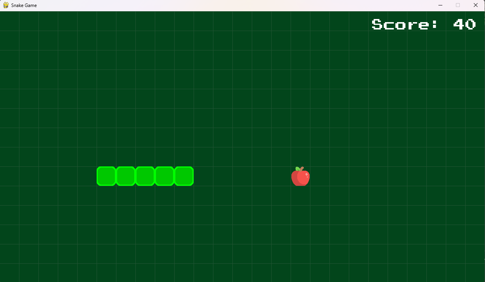
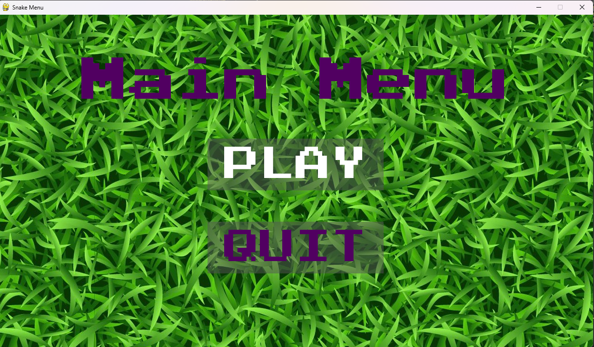
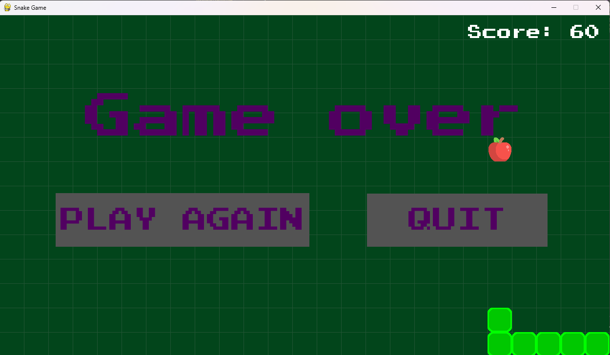

# Snake Game in Python using Pygame 
#### Video Demo:  https://youtu.be/gnBT4TnIPrY
#### Description:
This project is classic implementation of the Snake game build using the Pygame library in Python. The game features a snake controlled by the player, which moves around the screen, eating food to grow longer while avoiding collisions with itself and with boundaries of the screen area.

#### Features:
1. __Main Menu__: The game starts with a main menu screen where players can choose to start the game or quit.
2. __Gameplay__: Once the game starts, players control the movement of the snake using arrow keys or designated keys. The snake grows longer each time it eats food, and the player earns points for each food item consumed.
3. __Scoring__: A scoring system keeps track of the player's score, which increases with each food item eaten. The score is displayed on the screen during gameplay.
4. __Game Over Screen__: If the snake collides with itself or the boundaries of the play area, the game ends, and a game-over screen is displayed. From here, players can choose to play again or quit the game.
5. __Button implementation__ Not made by me. Was taken from [Baraltech/Menu-System-Pygame](https://github.com/baraltech/Menu-System-PyGame) 
#### Project Goals:
- Provide an entertaining and nostalgic gaming experience for players familiar with the classic Snake game.
- Showcase proficiency in using the Pygame library for game development.
- Practice object-oriented programming principles by structuring the game code into classes and modules for improved readability and maintainability.
- Implement fundamental game mechanics such as player control, collision detection, scoring, and game state management.
#### What are possible future enhancements:
- Implement __sound effects__ in the game to enhance the gaming experience and the feedback of the player actions such as the snake eating food and game over.
- Improve __game graphics__.
- Add support for __multiple levels__ or implement increasing difficult as the snake grow with increase snake speed.
- Implement a __high-score traking__ and leaderboard functionality to save past scores. 

 

The [Food class](food.py) define the food element of the game, it has tree attributes size game block, size of the game screen (x,y), and the pygame.Rect object (width, height, x, y) of the food.

The [Snake class](snake.py) define the snake element of the game. Some attributes are lenght of the snake, direction of the movement, head of the snake (snake.pixel), a list of the segments of the snake body.

The Main Class is where is define the game informations. Like the size of the pixel of the game, screen size of the game, path to the assets of the game, and the framerate (speed of update of the game screen).
In the main class has the game loops:
- main_menu() 
<figure>
    
    <figcaption>Menu of the game</figcaption>
</figure>

- new_game() 
The game loop to play
- game_over() 
<figure>
    
    <figcaption>
    The game over screen when the player collide with the boundaries and with the snake body. 
    </figcaption>
</figure>

